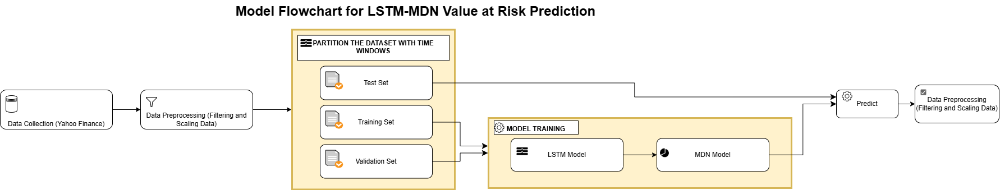
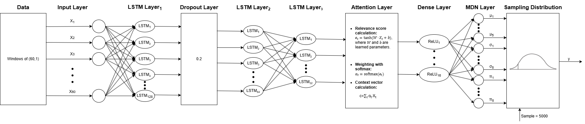

# Advancing Financial Risk Management: A Probabilistic Approach to Value at Risk Using LSTM-MDN Models

## Project Overview

This project presents an advanced approach to Value-at-Risk (VaR) estimation by integrating Long Short-Term Memory (LSTM) networks with Mixture Density Networks (MDNs). 

Traditional VaR methods—such as historical simulation, parametric VaR, and Monte Carlo simulation—often fail to capture complex, nonlinear dependencies and extreme events in financial data. 

The **LSTM-MDN framework** addresses these limitations by:
- Leveraging **LSTM** for sequential modeling.
- Utilizing **MDN** for probabilistic forecasting of the full return distribution.
- Evaluating multiple optimization algorithms (**Adam, Nadam, RMSprop**, etc.) to determine the best training strategy.

The model is benchmarked against conventional VaR estimation techniques using a diverse asset portfolio over a 23-year period. Key performance metrics include:
- Exception rates
- Kupiec and Christoffersen p-values
- Expected Shortfall (ES)
- Mean Excess Loss (MEL)

### Data Processing & Training Flowchart

### Detailed Model Flow

## Key Findings

1. **Enhanced Predictive Power**: The LSTM-MDN model outperforms traditional VaR estimation techniques, particularly when optimized with **RMSprop**.
2. **Probabilistic Flexibility**: The MDN allows the model to generate a full return distribution, improving risk assessment.
3. **Backtesting and Validation**:
   - **Kupiec and Christoffersen tests** confirm the model’s accuracy.
   - The model aligns with regulatory requirements for risk modeling.
4. **Market Regime Analysis**: The MDN mixture components provide insights into different market conditions, distinguishing between stable and volatile regimes.

## Project Structure

### 1. Data Collection & Preprocessing
- Historical financial data is collected using **Yahoo Finance**.
- A diverse portfolio of assets is analyzed over 23 years.
- Returns are standardized for modeling.

### 2. Traditional VaR Benchmarks
- **Historical Simulation**: Uses rolling windows to estimate VaR.
- **Parametric VaR**: Assumes normality and estimates VaR using mean-variance methods.
- **Monte Carlo Simulation**: Generates synthetic return distributions for VaR estimation.

### 3. LSTM-MDN Model Development
- **LSTM layers** extract temporal dependencies from return sequences.
- **Attention Mechanism** enhances interpretability by identifying key time steps.
- **MDN Output Layer** predicts multiple components of a Gaussian mixture, estimating the entire return distribution.

### 4. Model Training & Evaluation
- Training is conducted using **multiple optimizers**.
- Metrics such as **MAE, RMSE, Expected Shortfall**, and **Kupiec test p-values** are analyzed.
- The best optimizer is selected based on **exception rates and statistical validation tests**.

### 5. Results Visualization
- **VaR estimates are compared across methods**.
- **Heatmaps and scatter plots** illustrate model predictions and market regimes.

## References
This project was inspired by the work of **William Karlsson Lille and Daniel Saphir**. Their report, ["Finalreport_KarlssonLille_and_Saphir.pdf"](https://scila.se/wp-content/uploads/2021/07/Finalreport_KarlssonLille_and_Saphir.pdf), provided valuable insights.
